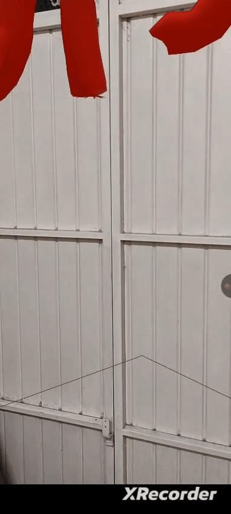

+++
showonlyimage = false
draft = false
date = "2025-11-16 09:41:19.550228"
image = "image.png"
title = "CavernAR"
weight = 2
+++

Realidade aumentada para o espaço imersivo "Caverna" do Acervo Artístico da UFSM 

<!--more-->

## Descrição

Um aplicativo web com Realidade Aumentada (AR) para enriquecer a experiência imersiva da exposição "Caverna" do Acervo Artístico da UFSM. 
Por meio de uma página web com acesso à câmera do smartphone, usuários podem criar e visualizar objetos 3D que ficam dispostos em salas virtuais.

Apresentação: [link](https://www.canva.com/design/DAG5qB6C84c/H_A65gI_4m1YDdBfgrbm_Q/edit?utm_content=DAG5qB6C84c&utm_campaign=designshare&utm_medium=link2&utm_source=sharebutton)

---

## Acesso

Link: 
https://elc1074.github.io/AR-Cave-Immersion/

Roteiro para testes: [link](https://docs.google.com/document/d/1N3XB8_5PK_Bq5p7NUHRT_mdXPzJejZVTHEza0O9IGNQ/)

---

## Desenvolvimento

##### Tecnologias

- HTML, CSS e Javascript compõem a base da aplicação, pois é uma aplicação web
- Toda a geometria 3D é renderizada através da biblioteca Three.js, com componentes de realidade aumentada do framework WebXR
- Para o banco de dados, utilizamos a plataforma de desenvolvimento Supabase que utiliza PostgreSQL e autenticação
- Para o deploy do front utilizamos Github Pages e deploy do back utilizamos a plataforma Render

##### Repositórios

- https://github.com/elc1074/AR-Cave-Immersion

##### Outros links

- [Documento de visão](https://docs.google.com/document/d/1kMfcPXl1BqeJa6O4EGFn6ky5Nnw8WVLR8ayv5A04KPo)

---

## Equipe

- Henrique Alexandre Marques da Costa (SI / UFSM)
- João Pedro Mendes de Sousa (SI / UFSM)
- Kaio Vittor dos Santos Fernandes (SI / UFSM)
- Lucas Medeiros Figueiredo dos Santos (SI / UFSM)
- Profª Andrea Charão (DLSC / UFSM)
- Adm. Rafael Happke (Acervo Artístico / UFSM)

